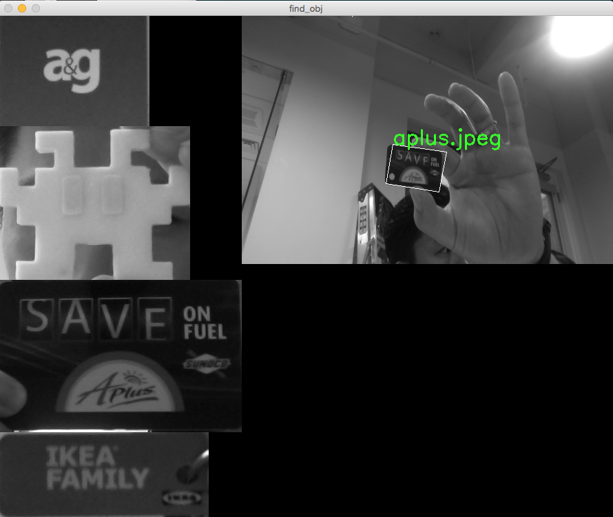

# Multiple Object Recognition on Video Feed #

Object Detection using SURF | SIFT | ORB with Python OpenCV 

Modification of [this code](https://github.com/Itseez/opencv/blob/master/samples/python2/find_obj.py) to use with webcam video feed.

### How to Use

  - replace images in image folder, script automatically read and train 
  - run find_obj.py with options of Alogorithm model. 
  - Ctrl + c to quit from command line

### TO-DO
- image replacement and training GUI
- Doing something with result

### Screenshot
